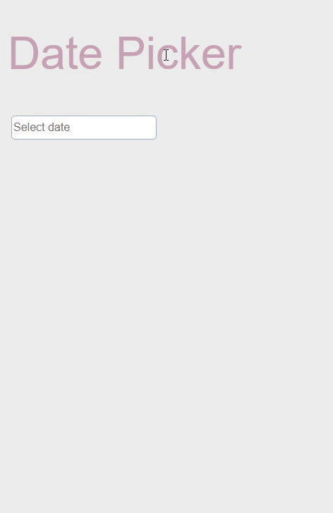

# 🗓 Date Picker & Calendar
<center>
  
</center>

## 💁‍♂️ Introducing Project
### Date Picker
> - HTML의 <input type="date"> 직접 구현해본 프로젝트
> - input을 클릭하면 처음 시작할 때는 오늘 날짜가 표기
> - 클릭했을 때 눌렸던 날짜를 기준으로 달력 다시 렌더

### Calendar
> - 이전 달, 다음 달 등으로 넘어가면 해당 월의 날짜 표기
> - 이전 달의 뒤 날짜, 다음 달의 앞 날짜를 계산해서 현재 달에 표기

## 🛠 Using Skill
> - HTML
> - CSS
> - Vanilla Javascript
> - Eslintrc

## 📁 Folder Structure
```
├─calendar 
│  ├─calendar.js : 달력 코어 로직
│  └─thema.css  : 데이터 피커 및 달력 스타일
├─index.html
└─main.js : 데이터 피커 및 달력 생성

```

## 🔧 How To Use?
#### start

```
npm install
```